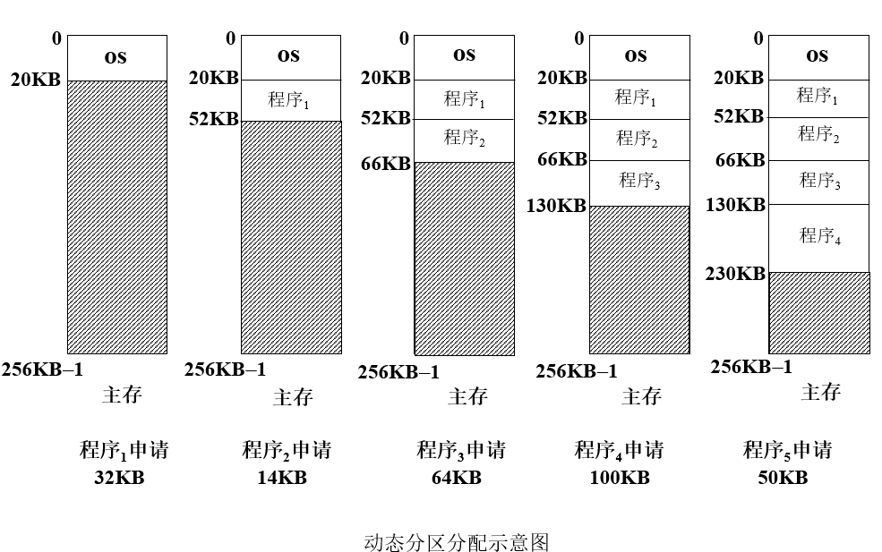
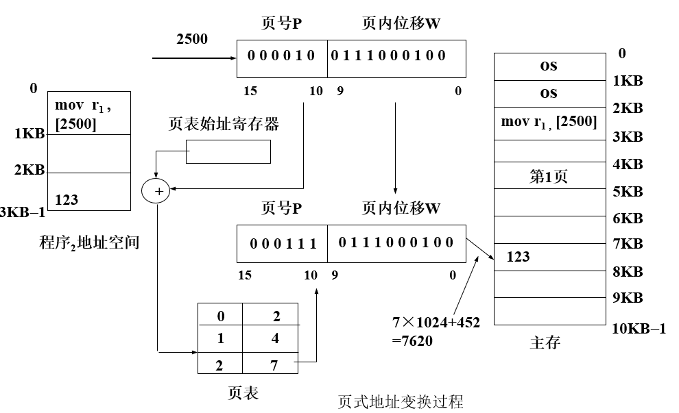

# 第6章 主存管理

## 6.1主存管理概述

### 6.1.1 主存分片共享

​      (1) 大小不等的区域

​		① 分区存储管理 ② 段式存储管理

​      (2) 大小相等的区域

​		页式存储管理

​     (3) 二者结合

​		段页式存储管理

### 6.1.2 程序的逻辑组织

   ​      (1) 一维地址结构

   ​	一个程序是一个连续、线性的地址结构；确定线性地址空间中的指令地址或操作数地址只需要一个信息。 

   

   (2) 二维地址结构

   一个程序由若干个分段组成，每个分段是一个连续的地址区；

   确定线性地址空间中的指令地址或操作数地址需要两个信息，一是该信息所在的分段，另一个是该信息在段内的偏移量。
	
   

 

## 6.2主存管理的功能

现代操作系统的主存管理实现了地址映射，主存分配，主存保护，虚拟主存等功能。

### 6.2.1 虚拟存储器

定义：由操作系统和硬件相配合来完成**主存和辅存之间的信息的动态调度**。 这样的计算机系统好像为用户提供了一个其**存储容量比实际主存大得多的存储器**，这个存储器称为**虚拟存储器**。

### 6.2.2  地址映射

定义：将程序地址空间中使用的逻辑地址变换成主存中的物理地址的过程，称为地址映射。

> 地址映射方式

- **编程或编译时**确定地址映射关系 

  在程序编写或程序编译时确定虚、实地址之间的对应关系，结果 是一 个不能浮动的程序模块。

- **在程序装入时**确定地址映射关系  

  在程序装入过程中随即进行的地址变换方式称为**静态地址映射** 。

- **在程序运行时**确定地址映射关系  

   在程序执行期间，随着每条指令和数据的访问自动地连续地进行地址映射，这种地址变换方式称为**动态地址映射**。

`静态地址映射与动态地址映射的区别`

|         静态地址映射         |            动态地址映射            |
| :--------------------------: | :--------------------------------: |
| 在程序装入过程中进行地址映射 |     在程序执行期间进行地址映射     |
|    需软件(重定位装入程序)    | 需要硬件地址变换机构(重定位寄存器) |
|     需要花费较多CPU时间      |             地址变换快             |
|            不灵活            |                灵活                |

### 6.2.3 主存分配

主存管理存储器的策略有以下3种：

1. 放置策略 —— 在可用资源中，选择一个空闲区的原则 

2. 调入策略 —— 决定信息装入主存的时机 

   预调策略：预先将信息调入主存

   请调策略：当需要信息时，将信息调入主存

3. 淘汰策略 —— 在主存中没有可用的空闲区时，决定哪些信息从主存中移走，即确定淘汰已占用的内存区的原则。 

### 6.2.4 存储保护

定义：在多用户环境中 ，为了防止用户程序之间的互相干扰。

实现方法：

- 上下界防护

  硬件为分给应用程序的每一个连续的主存空间设置一对上下界寄存器，由它们分别指向该存储空间的上界和下界。在进程运行过程中，产生的每一个访问主存的物理地址D,硬件都要将**它与上，下界比较，判断是否越界**。如果访问主存的物理地址超出了这个范围，**便产生保护性中断**。

- 基址，限长防护

  基址寄存器存放的是当前正执行着的进程的地址空间所占分区的起始地址，限长寄存器存放的是该地址空间的长度。进程运行时所产生的逻辑地址和限长寄存器的内容比较，如**超出限长**，则发出越界中断信号。

  

## 6.3分区存储管理及存在的问题

### 6.3.1 动态分区存储管理技术

​      (1) 什么是动态分区分配 

​             在处理程序的过程中，建立分区，依用户请求的大小分配分区。

### 

### 6.3.2 分区的分配与回收

(1) 分区分配思路

① 寻找空闲块

​      依申请者所要求的主存区的大小，分区分配程序在**自由主存队列**中找一个**满足用户需要**的空闲块；

② 若找到了所需的空闲区，有两种情况

​	空闲区与要求的**大小相等**，将该空闲区分配并**从队列中摘除**；**空闲区大于所要求的的大小**，将空闲区分为**两部分**：**部分成为已分配区**，**建立已分配区的描述器**；**剩下部分  仍为空闲区**。返回所分配区域的首址；

③ **否则，告之不能满足要求** 

(2) 分区回收思路 

① 检查释放分区 (即为回收分区)在主存中的邻接情况，若**上、下邻接空闲区**，则**合并，成为一个连续的空闲区**

② 若回收**分区不与任何空闲区相邻接**， **建立一个新的空闲区**，并加入到空闲区队列中。

### 6.3.3 放置策略

选择空闲区的策略，称为放置策略。

          常用的放置策略——

1.**首次匹配 (首次适应算法)**

定义：首次适应算法是将输入的程序放置到主存里第一个足够装 入它的地址**最低的空闲区**中。

​      	   空闲区地址**由低到高排序**(空闲区队列结构 )。

特点：尽可能地利用存储器中低地址的空闲区，而尽量保存高地址的空闲区。

2.**最佳匹配 (最佳适应算法)**

定义：最佳适应算法是将输入的程序放置到主存中与它所**需大小最接近的空闲区中**。

​	   空闲区**大小由小到大排序** (空闲区队列结构 )。

特点：尽可能地利用存储器中小的空闲区，而尽量保存大的空闲区。

3.**最坏匹配 (最坏适应算法)**

定义：最坏适应算法是将输入的程序放置到主存中与它所需大小**差距最大**的空闲区中。

​	   空闲区大**小由大到小排序** (空闲区队列结构 )。

特点：尽可能地利用存储器中大的空闲区。

### 6.3.4 碎片问题及拼接技术

碎片问题定义： 在**已分配区之间**存在着的一些**没有被充分利用的空闲区**。 

拼接技术：是指移动存储器中某些已分配区中的信息，使本来分散的空闲区连成一个大的空闲区。        

## 6.4 页式存储管理

### 6.4.1 页式系统应解决的问题

不需要移动主存原有的信息就**解决了碎片问题，提高了主存的利用率**。

### 6.4.2 页式地址变换

(1) 页面

​         程序的**地址空间**被等分成**大小相等的片**，称为页面，又称为**虚页**。

(2) 主存块

​      	**主存**被等分成**大小相等的片**，称为主存块，又称为**实页**。

(3) 页表

​	为了实现从**地址空间到物理主存**的映象，系统建立的**记录页**与**内存块之间对应关系**的**地址变换的机构**称为页面映像表，简称页表。

**页表的组成** :

高速缓冲存储器 ： 地址变换速度快，但成本较高 

主存区域 ：地址变换速度比硬件慢，成本较低 

**虚地址结构** 

当CPU给出的虚地址长度为32位，页面大小为4KB时，在分页系统中虚地址结构如下图所示。

0-11位代表页内位移；12-31位代表页号。

**页式地址变换过程** 

### 6.4.3 请求页面的机制

① 简单页式系统：装入一个程序的全部页面才能投入运行

② **请求页式系统**： 装入一个程序的部分页面即可投入运行。      

**扩充页表功能**      

| 页号 | 主存块号 | 中断位 | 辅存地址 |
| :--: | :------: | :----: | :------: |
|      |          |        |          |

中断位i ：  标识该页是否在主存，若i=1，表示此页不在主存；若i=0，表示该页在主存

辅存地址 ：该页面在辅存的位置。

### 6.4.4 淘汰机制与策略

用来**选择淘汰哪一页的规则**叫做置换策略，或称淘汰算法 。

(1) 扩充页表功能      

| 页 号 |          主存块号  |      中断位  |         辅存地址      |    引用位 |        改变位 |

引用位  ——  标识该页最近是否被访问 ,为“0”—— 该页没有被访问；为“1”—— 该页已被访问

改变位  ——  表示该页是否被修改,为”1“被修改过。为了在淘汰一页时决定是否需要写回到辅存而设置的。

 (3) 颠簸

​       颠簸(thrashing)，又称为“抖动”。简单地说，导致**系统效率急剧下降的**主存和辅存之间的 **频繁页面置换现像**称为“抖动”。     

### 6.4.5 几种置换算法

① 最佳算法(OPT算法) 

​      当要调入一新页而必须先淘汰一旧页时，所淘汰的那一页 应是以后不再要用的，或者是在最长的时间以后才会用到  的那页。 

② 先进先出淘汰算法(FIFO算法)     

​      总是选择在主存中居留时间最长 (即最早进入主存)的一页淘汰。

③ 最久未使用淘汰算法(LRU算法) 

​      总是选择最长时间未被使用的那一页淘汰。

