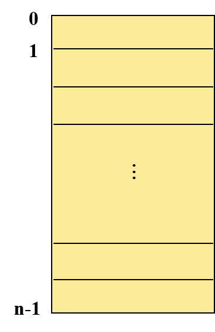

# 第6章 主存管理

## 6.1主存管理概述

### 6.1.1 主存分片共享

​      (1) 大小不等的区域

​		① 分区存储管理 ② 段式存储管理

​      (2) 大小相等的区域

​		页式存储管理

​     (3) 二者结合

​		段页式存储管理

### 6.1.2 程序的逻辑组织

   ​      (1) 一维地址结构

   ​	一个程序是一个连续、线性的地址结构；确定线性地址空间中的指令地址或操作数地址只需要一个信息。 

   

   (2) 二维地址结构

   一个程序由若干个分段组成，每个分段是一个连续的地址区；

   确定线性地址空间中的指令地址或操作数地址需要两个信息，一是该信息所在的分段，另一个是该信息在段内的偏移量。

   

 

## 6.2主存管理的功能

现代操作系统的主存管理实现了地址映射，主存分配，主存保护，虚拟主存等功能。

### 6.2.1 虚拟存储器

定义：由操作系统和硬件相配合来完成**主存和辅存之间的信息的动态调度**。 这样的计算机系统好像为用户提供了一个其**存储容量比实际主存大得多的存储器**，这个存储器称为**虚拟存储器**。

### 6.2.2  地址映射

定义：将程序地址空间中使用的逻辑地址变换成主存中的物理地址的过程，称为地址映射。

> 地址映射方式

- **编程或编译时**确定地址映射关系 

  在程序编写或程序编译时确定虚、实地址之间的对应关系，结果 是一 个不能浮动的程序模块。

- **在程序装入时**确定地址映射关系  

  在程序装入过程中随即进行的地址变换方式称为**静态地址映射** 。

- **在程序运行时**确定地址映射关系  

   在程序执行期间，随着每条指令和数据的访问自动地连续地进行地址映射，这种地址变换方式称为**动态地址映射**。

`静态地址映射与动态地址映射的区别`

|         静态地址映射         |            动态地址映射            |
| :--------------------------: | :--------------------------------: |
| 在程序装入过程中进行地址映射 |     在程序执行期间进行地址映射     |
|    需软件(重定位装入程序)    | 需要硬件地址变换机构(重定位寄存器) |
|     需要花费较多CPU时间      |             地址变换快             |
|            不灵活            |                灵活                |

### 6.2.3 主存分配

主存管理存储器的策略有以下3种：

1. 放置策略 —— 在可用资源中，选择一个空闲区的原则 

2. 调入策略 —— 决定信息装入主存的时机 

   预调策略：预先将信息调入主存

   请调策略：当需要信息时，将信息调入主存

3. 淘汰策略 —— 在主存中没有可用的空闲区时，决定哪些信息从主存中移走，即确定淘汰已占用的内存区的原则。 

### 6.2.4 存储保护

定义：在多用户环境中 ，为了防止用户程序之间的互相干扰。

实现方法：

- 上下界防护

  硬件为分给应用程序的每一个连续的主存空间设置一对上下界寄存器，由它们分别指向该存储空间的上界和下界。在进程运行过程中，产生的每一个访问主存的物理地址D,硬件都要将它与上，下界比较，判断是否越界。如果访问主存的物理地址超出了这个范围，便产生保护性中断。

- 基址，限长防护

  基址寄存器存放的是当前正执行着的进程的地址空间所占分区的起始地址，限长寄存器存放的是该地址空间的长度。进程运行时所产生的逻辑地址和限长寄存器的内容比较，如超出限长，则发出越界中断信号。

  

## 6.3分区存储管理及存在的问题

### 6.3.1 动态分区存储管理技术

### 6.3.2 分区分配机构

### 6.3.3 分区分配与放置策略

### 6.3.4 碎片问题及拼接技术

## 6.4 页式存储管理

### 6.4.1 页式系统应解决的问题

### 6.4.2 页式地址变换

### 6.4.3 请求页面的机制

### 6.4.4 淘汰机制与策略

### 6.4.5 几种置换算法

## 6.5 段式和段页式存储管理

### 6.5.1  段式地址结构

### 6.5.2 段式地址变换

### 6.5.3 扩充段表功能

### 6.5.4 段页式存储管理

